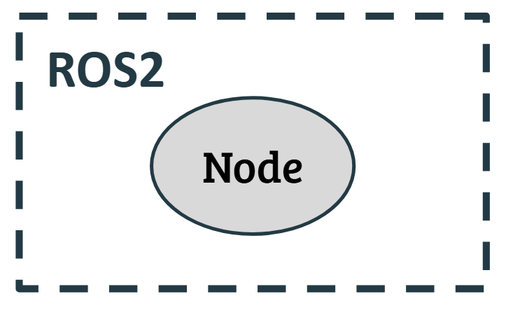

<!-- Nota que indica los requisitos de instalación de ROS2 y colcon. -->
> [!NOTE]
> Para continuar con este tutorial es necesario haber instalado previamente [**_ROS2_**](https://docs.ros.org/en/jazzy/Installation/Alternatives/Ubuntu-Development-Setup.html) y el gestor de paquetes [**_colcon_**](https://docs.ros.org/en/jazzy/Tutorials/Beginner-Client-Libraries/Colcon-Tutorial.html#install-colcon).

## ¿Qué es un nodo en `ROS2`?

Un **_nodo_** es una unidad básica de ejecución que realiza una tarea específica dentro de un sistema robótico distribuido. Es el componente fundamental para organizar y modularizar el software de un robot con `ROS 2`.\

Cada **_nodo_** realiza una tarea específica, como recibir datos de un sensor, controlar un motor o realizar un cálculo.

## Resumen

Resumen

---

\
__#############__ Tutorial oficial de ROS2 __#############__

Esta información fue desarrollada gracias al tutorial de ROS2 (Jazzy) en su sitio oficial:

1. Tutorial de colcon: https://docs.ros.org/en/jazzy/Tutorials/Beginner-Client-Libraries/Colcon-Tutorial.html
2. Creando un workspace: https://docs.ros.org/en/jazzy/Tutorials/Beginner-Client-Libraries/Creating-A-Workspace/Creating-A-Workspace.html