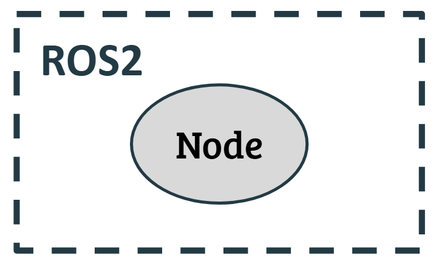
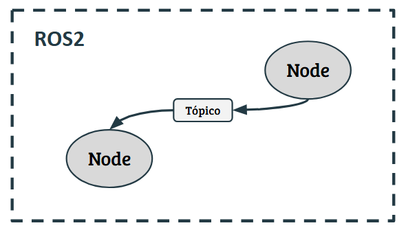
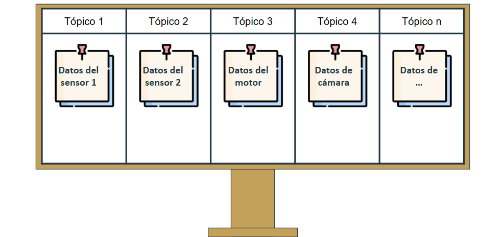

<!-- Nota que indica los requisitos de instalación de ROS2 y colcon. -->
> [!NOTE]
> Para continuar con este tutorial es necesario haber instalado previamente [**_ROS2_**](https://docs.ros.org/en/jazzy/Installation/Alternatives/Ubuntu-Development-Setup.html) y el gestor de paquetes [**_colcon_**](https://docs.ros.org/en/jazzy/Tutorials/Beginner-Client-Libraries/Colcon-Tutorial.html#install-colcon).

## ¿Qué es un nodo en `ROS2`?

Un **_nodo_** es una unidad básica de ejecución que realiza una tarea específica dentro de un sistema robótico distribuido. Es el componente fundamental para organizar y modularizar el software de un robot con `ROS 2`.\
Cada **_nodo_** realiza una tarea específica, como recibir datos de un sensor, controlar un motor o realizar un cálculo. Cada nodo puede comunicar sus datos o recibir los datos de otro nodo a través de **tópicos**.

<p align="center">

</p>

## ¿Qué son los tópicos?

Los tópicos son un mecanismo de comunicación asincrónica que permite el intercambio de mensajes entre nodos. Los tópicos actúan como canales donde los nodos pueden publicar o suscribirse a mensajes. Los nodos que comparten datos se les conocen como **publicadores** y los nodos que reciben datos se les conocen como **suscriptores**.

<p align="center">

</p>

Una buena analogía para enteder los tópicos es pensar en un **tablero de comunicados públicos** donde existen dos tipos de personas:

- **Publicadores**:
Son las personas o entidades que colocan notas en el tablero. Estas notas contienen información específica (los mensajes) que quieren compartir.

- **Suscriptores**:
Son las personas que están atentas al tablero y revisan constantemente si hay nuevas notas que les interesen (los mensajes publicados).

Siguiendo esta analogía, los **tópicos** son ese tablero donde se publican los mensajes y que permite comunicar al publicador con el suscriptor. 

Imagina un tablero en un parque: alguien publica notas con clima actual y otra persona publica notas con eventos locales.
Unos interesados pueden leer las notas relacionadas con el clima y otros interezados pueden leer las notas de los eventos.

<p align="center">

</p>

Es de esta manera que los nodos se comunican entre ellos. Ahora solo falta saber cómo se programan los nodos.

## ¿Cómo creamos nodos publicadores y suscriptores?

Lo primero que hay que hacer es cambiarnos al workspace que creamos previamente y crear un nuevo paquete que tendrá el código de un publicador.

``` bash
$ cd ws_workspace/src     # Cambiamos al directorio src del ws
$ source /opt/ros/jazzy/setup.bash  # Inicializamos ROS2
$ ros2 pkg create --build-type ament_cmake --license Apache-2.0 pkg_pub # Creamos un nuevo paquete
```

Ya que tenemos nuestro nuevo paquete creado, iremos al directorio `/src` de nuestro paquete y crearemos el código (`C++`) para un nodo publicador:

``` bash
cd pkg_pub/src  # Vamos al directorio /src del paquete
touch minimal_publisher.cpp
```

Ahora con tu entorno de desarrollo favorito procederemos a escribir el código en `minimal_publisher.cpp` y generar un _**nodo publicador**_.

#### Código publicador
``` cpp
#include <chrono>
#include <memory>
#include <string>

#include "rclcpp/rclcpp.hpp"
#include "std_msgs/msg/string.hpp"

using namespace std::chrono_literals;

class MinimalPublisher : public rclcpp::Node
{
public:
  MinimalPublisher()
  : Node("minimal_publisher"), count_(0)
  {
    publisher_ = this->create_publisher<std_msgs::msg::String>("topic", 10);
    auto timer_callback =
      [this]() -> void {
        auto message = std_msgs::msg::String();
        message.data = "Hello, world! " + std::to_string(this->count_++);
        RCLCPP_INFO(this->get_logger(), "Publishing: '%s'", message.data.c_str());
        this->publisher_->publish(message);
      };
    timer_ = this->create_wall_timer(500ms, timer_callback);
  }

private:
  rclcpp::TimerBase::SharedPtr timer_;
  rclcpp::Publisher<std_msgs::msg::String>::SharedPtr publisher_;
  size_t count_;
};

int main(int argc, char * argv[])
{
  rclcpp::init(argc, argv);
  rclcpp::spin(std::make_shared<MinimalPublisher>());
  rclcpp::shutdown();
  return 0;
}
```

## Resumen

Resumen

---


\
__#############__ Tutorial oficial de ROS2 __#############__

Esta información fue desarrollada gracias al tutorial de ROS2 (Jazzy) en su sitio oficial:

1. Tutorial de colcon: https://docs.ros.org/en/jazzy/Tutorials/Beginner-Client-Libraries/Colcon-Tutorial.html
2. Creando un workspace: https://docs.ros.org/en/jazzy/Tutorials/Beginner-Client-Libraries/Creating-A-Workspace/Creating-A-Workspace.html